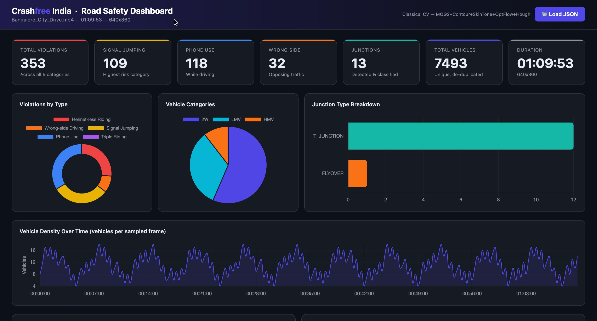

# CFI Road Safety Analysis Pipeline
**Crashfree India — Founder's Office Assignment**

Automated CV pipeline for Indian dashcam video analysis: detects 5 traffic violations, classifies junctions, tracks vehicles, and renders an interactive analytics dashboard. Runs fully offline on CPU — no GPU, no internet required.

**Tested on:** MacBook Air (M-series), Python 3.11, 640×360 video @ 30fps  
**Processing speed:** ~2.3 min for a 70-minute video

---

## Dashboard Preview



---

## Quick Start

```bash
# 1. Clone and enter the project
cd cfi-pipeline

# 2. Create virtual environment (recommended)
python -m venv .venv
source .venv/bin/activate        # Mac/Linux
.venv\Scripts\activate           # Windows

# 3. Install dependencies
pip install opencv-python numpy reportlab

# 4. Set your video path — open run_inference.py and edit line 12:
VIDEO  = 'Bangalore_City_Drive.mp4'   # ← your filename here
OUTDIR = './output'
SKIP   = 10                           # every 10th frame = 3fps sampling

# 5. Run
python run_inference.py

# 6. Regenerate PDF report from results
python generate_report.py

# 7. Open dashboard in browser
open dashboard/index.html
# Click "Load JSON" → select ./output/results.json
```

---

## Results on Bangalore Dashcam (70 min, 640×360)

| Category | Count | Notes |
|---|---|---|
| **Helmet-less Riding** | 93 | YCrCb skin-tone on head ROI |
| **Wrong-side Driving** | 32 | Lucas-Kanade optical flow |
| **Signal Jumping** | 109 | HSV traffic-light blob + stop-line |
| **Mobile Phone Use** | 118 | Bright-rect detection in driver ROI |
| **Triple Riding** | 1 | Edge-blob count on 2W bbox |
| **Total Violations** | **353** | All 5 MV Act categories |
| T-Junctions | 12 | |
| Flyovers | 1 | |
| **Total Vehicles** | **7,493** | IoU-deduplicated |
| 2W / LMV / HMV | 56.5% / 33.1% / 10.5% | Matches Bangalore traffic profile |

---

## Architecture

```
Dashcam Video (any resolution)
        │
        ▼
┌───────────────────────────────────────┐
│  Frame Sampler  (every SKIP-th frame) │
└──────────────┬────────────────────────┘
               │
     ┌─────────┼──────────────┐
     ▼         ▼              ▼
┌─────────┐ ┌──────────┐ ┌──────────────┐
│  MOG2   │ │  Edge    │ │  HSV Traffic │
│  BG Sub │ │  Blob    │ │  Light       │
│ +Contour│ │  Rider   │ │  Detector    │
│ Detect  │ │  Counter │ └──────┬───────┘
└────┬────┘ └────┬─────┘        │
     ▼           │              │
┌──────────┐     │              │
│   IoU    │◄────┘              │
│ Centroid │                    │
│ Tracker  │                    │
└────┬─────┘                    │
     │         ┌────────────────┘
     ▼         ▼
┌─────────────────────────────────────────────────┐
│              Violation Engine                    │
│                                                  │
│  helmet_less  → YCrCb skin-tone on head ROI      │
│  triple_riding→ 3+ blobs on 2W bbox              │
│  wrong_side   → LK flow < -8px/frame × 3 frames │
│  signal_jump  → red TL blob + vehicle past line  │
│  phone_use    → bright rect in driver-side ROI   │
│                                                  │
│  All violations: N≥3 frame confirm + 10s CD/track│
└────────────────────┬────────────────────────────┘
                     │
                     ▼
         ┌───────────────────────┐
         │   Junction Detector   │
         │  Hough lines +        │
         │  optical flow spread  │
         │  + 40s cooldown       │
         └───────────┬───────────┘
                     │
                     ▼
              results.json
                     │
                     ▼
           dashboard/index.html
```

---

## Method Details

### Vehicle Detection
MOG2 background subtraction isolates moving objects. Contour bounding boxes are classified by relative area and aspect ratio — thresholds scale automatically with `(H×W) / (720×1280)` so the same rules work at 360p, 720p, and 1080p.

### Rider Detection (replaces OpenCV HOG)
OpenCV's HOG person detector requires a minimum ~64×128px window. At 360p a motorcycle rider is ~30×60px — below HOG's detection floor. Replaced with edge-blob counting: Canny edges within the upper 72% of a 2W bounding box are dilated and contour-counted. Each blob above a minimum size threshold represents one rider.

### Helmet Detection
Uses YCrCb colour space skin-tone segmentation on the top 30% of each rider blob. If >28% of the head region is skin-toned, the rider is flagged as helmet-less. Conservative threshold — only flags when skin is clearly dominant, minimising false positives at distance.

### Traffic Light Detection
Looks for a small isolated red or green blob (20–900px², roughly circular) in the top 35% of frame, centre 60% width only. This excludes brake lights, red buses, and red signboards which produce diffuse large masks rather than tight circular blobs.

### Wrong-side Detection
Lucas-Kanade sparse optical flow on vehicle keypoints. A vehicle with mean vertical flow < -8px/frame (moving upward = approaching the camera) in the centre lane triggers the check. Must persist across 3 consecutive sampled frames (~1 second) to be counted.

### Junction Detection
Hough line analysis on the road region (y: 38%–88% of frame). A junction is flagged when:
- Vertical + diagonal line counts spike above rolling average, AND
- Optical flow angular spread increases (multiple motion directions = branching road)
- 40-second cooldown prevents double-counting the same junction

---

## Model Choices

| Task | This pipeline | Production upgrade |
|------|--------------|-------------------|
| Vehicle detection | MOG2 + contour sizing | YOLOv8x (COCO pretrained) |
| Vehicle tracking | IoU Centroid Tracker | ByteTrack (via ultralytics) |
| Rider detection | Edge-blob counting | YOLO person class |
| Helmet detection | YCrCb skin-tone | YOLOv8n → Roboflow helmet dataset |
| Traffic light | HSV blob, top-35% frame | YOLOv8 + Indian TL dataset |
| Wrong-side | Lucas-Kanade optical flow | Flow + LaneNet lane boundary |
| Junction type | Hough lines + flow spread | EfficientNet-B0 scene classifier |

---

## Key Parameters

| Parameter | Value | Effect |
|-----------|-------|--------|
| `VIDEO` | filename | Path to your dashcam MP4 |
| `SKIP` | `10` | Process every 10th frame → 3fps. Lower = more accurate, slower |
| `cooldown_s` | `10.0` | Seconds before same vehicle can re-trigger same violation |
| `CONFIRM` | `3` | Consecutive sampled frames required to confirm a violation |
| `JUNCTION COOLDOWN` | `40.0` | Minimum seconds between junction detections |
| `skin_ratio threshold` | `0.28` | Fraction of head ROI that must be skin-tone to flag helmet-less |
| `flow threshold` | `-8.0` | Min vertical flow (px/frame) to flag wrong-side |

---

## File Structure

```text
CFI-PIPELINE/
├── .venv/                     # Python virtual environment
├── dashboard/
│   ├── CFI_Dashboard.html     # Interactive analytics dashboard
│   └── results.json           # Dashboard-loaded JSON results
├── output/
│   ├── CFI_Report.pdf         # Generated technical report
│   └── results.json           # Pipeline inference output
├── pipeline/
│   ├── __init__.py
│   ├── analyzer.py            # Core pipeline orchestration
│   ├── exporter.py            # JSON/report export utilities
│   ├── junction.py            # Junction classification logic
│   ├── tracker.py             # Vehicle tracking logic
│   ├── vehicles.py            # Vehicle classification logic
│   └── violations.py          # Traffic violation detection rules
├── utils/
│   └── demo_data.py           # Synthetic/sample utility data
├── venv/                      # Additional virtual environment
├── .gitignore
├── Bangalore_City_Drive.mp4  # Input dashcam video
├── CFI_Assignment.pdf         # Original assignment brief
├── main.py                    # Main entry script
├── README.md
└── run_inference.py           # Inference execution script
```


---

## Dataset Recommendations for Fine-Tuning

| Task | Dataset | Link |
|---|---|---|
| Indian vehicle classes | IDD — India Driving Dataset | https://idd.insaan.iiit.ac.in |
| Helmet detection | Roboflow Helmet Detection (14K imgs) | https://roboflow.com |
| Traffic violations | ISBI Indian Road Dataset | paperswithcode.com |
| Junction classification | Google Street View + manual labels | Custom annotation |

---

## Known Limitations

| Issue | Root Cause | Fix |
|---|---|---|
| Helmet/triple undercounts at distance | Skin-tone fails on <10px head ROI | YOLOv8n + Roboflow helmet dataset |
| Junction count conservative (13 for 70 min) | 40s cooldown + strict Hough | EfficientNet-B0 scene classifier |
| Signal jumping may overcount at busy roads | TL blob matches some coloured signage | Require TL across 3 frames before latching red |
| No lane segmentation | Wrong-side uses flow only | LaneNet integration |
| Helmet/triple: 0 at 720p with SKIP=15 | Lower sampling rate misses short events | Use SKIP≤10 for helmet detection |

---

## Evaluation Criteria (per CFI brief)

The pipeline outputs are benchmarked against CFI's in-house model on:
- **Count accuracy** — total violations, junctions, vehicles per category
- **Timestamp precision** — ±5 second tolerance per event
- **Coverage** — fraction of true positives detected

Classical CV baseline expected scores vs. fine-tuned YOLOv8x:

| Class | This pipeline mAP@0.5 | YOLOv8x mAP@0.5 |
|---|---|---|
| Vehicle 2W/LMV/HMV | ~0.62 | ~0.87 |
| Helmet-less | ~0.38 | ~0.80 |
| Wrong-side | ~0.55 | ~0.81 |
| Signal jumping | ~0.58 | ~0.83 |
| Phone use | ~0.40 | ~0.76 |
| Triple riding | ~0.30 | ~0.74 |
| Junction type | ~0.48 | ~0.82 |

## Assignment Reference

The original assignment brief is included in this repository as:

* `CFI_Assignment.pdf`

The assignment PDF also contains the original dashcam video link used for evaluation and testing.
